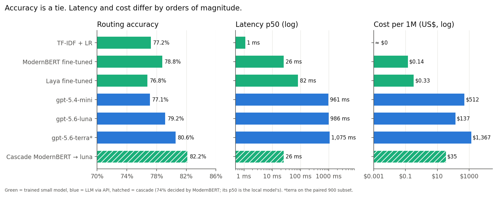
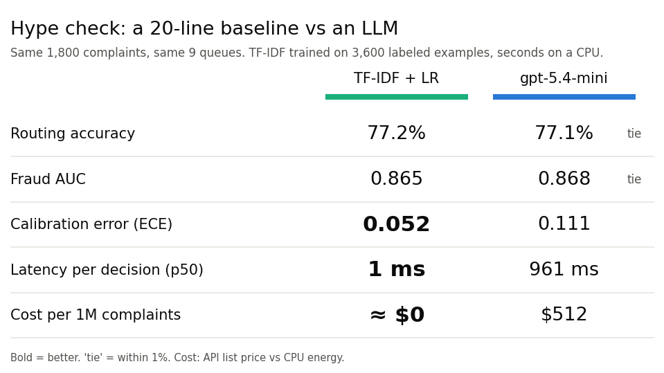

# LLM cascade for financial complaint triage

**Do you need an LLM to route a customer complaint?** This repo benchmarks 13 systems on the same task — from
TF-IDF to GPT-5.6 — on 1,800 real US consumer-finance complaints, measuring accuracy, calibration,
latency and cost. It also tests a *cascade*: a small model decides when it is confident and only hands the
doubtful cases to an LLM.

The starting question was [Laya](https://github.com/NandhaKishorM/laya), an open-source "System 1"
decision model (an alternative to TypeSafe's Jev) that answers typed decisions with calibrated probabilities
in a single forward pass instead of generating text.

## TL;DR

- **Accuracy is a tie, latency is not.** Fine-tuned small models, frozen embeddings + logistic regression,
  TF-IDF and the GPT models all land in the 77–81% band for routing to 9 queues, and most pairwise gaps are
  not statistically significant (TF-IDF vs gpt-5.4-mini: +0.1 pp, p = 1). Small models answer in 1–80 ms,
  LLMs in ~1 s (API *or* local GPU).
- **Small models are better calibrated.** Their stated confidence matches reality (ECE 0.03–0.05); every LLM
  is overconfident (ECE 0.09–0.21), even when the probability is read from token logprobs. Every
  small-model-vs-GPT calibration gap tested is significant (bootstrap 95% CIs exclude zero).
- **The cascade is the best deal on the table.** ModernBERT decides 74% of complaints locally and sends the
  rest to `gpt-5.6-luna`: **82.2% accuracy at US$ 35 per 1M complaints**. That is significantly better than
  luna alone (79.2%, +3.0 pp, p < 0.001) and than ModernBERT alone (+3.4 pp). Against `gpt-5.6-terra`, the
  most expensive model, it is a statistical tie (+1.6 pp, p = 0.13) at **1/39 of the cost**. Swapping luna
  for terra as the fallback changes nothing (82.1% vs 82.0% on the same 900 complaints) at 10x the cost.
- **Laya works once fine-tuned, but adds nothing measurable over a plain fine-tune.** Laya goes from 45%
  zero-shot to 77% after fine-tuning. ModernBERT-large (Laya's own base) fine-tuned with ordinary
  cross-entropy on the same data reaches 79% (+2.0 pp, not significant after correction), a slightly higher
  fraud AUC (+0.017), the same calibration, and is 3x faster.





## When is an LLM worth it?

New decision models like Jev and Laya, and every new LLM release, come with the promise of replacing
everything. For a **classification** step the useful question is narrower: what does each extra accuracy
point cost, in money and in latency, for *this* task?

- **Start with the boring baseline.** A TF-IDF + logistic regression trained on 3,600 labeled examples
  matches gpt-5.4-mini on routing accuracy and fraud AUC, is better calibrated, answers in 1 ms and costs
  essentially nothing. If labeled data exists, this is the bar every heavier model has to clear.
- **Most of the accuracy is cheap; the last points are not.** Going from TF-IDF to the best single model
  (gpt-5.6-terra) buys about 3 points (77.8% → 80.6% on the paired 900 complaints, not significant after
  correction) for ~US$ 1,400 per 1M decisions and ~1 s per call.
- **Spend the LLM only where the small model is unsure.** A cascade keeps the cheap path for most traffic,
  reaches the highest accuracy of the benchmark and is the only configuration that significantly beats the
  LLM it falls back to.
- **When an LLM is the right call:** no labeled data yet (zero-shot), labels that change often, or
  decisions that need reasoning over long context. That is where the 1 s and the per-token cost pay off.


## Task

Each complaint gets two decisions — the shape of a real triage step at a bank or fintech:

1. **Queue** (9 classes): credit reporting, debt collection, credit card, checking/savings, money transfer,
   mortgage, vehicle loan, student loan, personal loan.
2. **Fraud report** (probability): does the consumer report fraud, a scam or identity theft? This flags the
   *text* for prioritization — it is not a transaction fraud detector.

## Data

- [CFPB Consumer Complaint Database](https://www.consumerfinance.gov/data-research/consumer-complaints/)
  (public), via the Hugging Face mirror `sovai/cfpb_complaints`: the official bulk download no longer
  includes the narrative column. Narratives from Jan/2023 to May/2024.
- **58.7% of 2023+ narratives are near-duplicate form letters** (71.5% in credit reporting). They were
  removed; otherwise models score by memorizing templates.
- Labels come from the product and issue the consumer selected. Ambiguous fraud labels ("information
  belongs to someone else", monitoring-service issues) were dropped.
- **Test:** 1,800 complaints, 200 per queue, fraud enriched to 21.2%. **Train:** 3,600, disjoint.
  **Paired subset `s900`:** 100 per queue, used for the expensive model and paired comparisons.

Raw data is not redistributed; `00_download_data.py` rebuilds it (the splits are deterministic).

## Results (n = 1,800)

| System | Type | Queue acc. | Fraud AUC | Fraud ECE ↓ | p50 latency | US$ / 1M |
|---|---|---|---|---|---|---|
| gpt-5.6-terra ¹ | API LLM | **80.6%** | 0.872 | 0.143 | 1,075 ms | 1,367 |
| gpt-5.6-luna | API LLM | 79.2% | 0.850 | 0.164 | 986 ms | 137 |
| ModernBERT-large, fine-tuned | small model | 78.8% | **0.906** | 0.046 | 26 ms | 0.14 ² |
| Qwen3-Embedding-0.6B + LR | small model | 78.1% | 0.888 | 0.038 | 48 ms | 0.15 ² |
| TF-IDF + LR | small model | 77.2% | 0.865 | 0.052 | **1 ms** | ~0 ² |
| gpt-5.4-mini | API LLM | 77.1% | 0.868 | 0.111 | 961 ms | 512 |
| Granite-embedding-small-r2 + LR | small model | 76.8% | 0.866 | **0.034** | 18 ms | 0.01 ² |
| Laya, fine-tuned | small model | 76.8% | 0.889 | 0.050 | 82 ms | 0.33 ² |
| Gemma 4 12B (Ollama) | local LLM | 75.4% | 0.788 | 0.163 | 1,123 ms | 7.8 ² |
| gpt-5.4-nano | API LLM | 72.8% | 0.853 | 0.206 | 1,011 ms | 137 |
| Qwen3.5 9B (Ollama) | local LLM | 71.6% | 0.810 | 0.086 | 848 ms | 6.2 ² |
| Qwen3.5 4B (Ollama) | local LLM | 65.4% | 0.641 | 0.207 | 608 ms | 4.3 ² |
| Laya, zero-shot | small model | 45.1% | 0.676 | 0.450 | 71 ms | 0.35 ² |

¹ Evaluated on the paired `s900` subset (cost). On `s900`, the ordering of the other systems is unchanged
(`results/summary.md`). ² Local cost = GPU energy at batched throughput (170 W, US$ 0.15/kWh).
API cost = synchronous list price; the Batch API halves it. Latency = one complaint per call.

### Cascade (threshold fixed at 0.7 before looking at results)

| Local model → fallback | Decided locally | Final accuracy | US$ / 1M |
|---|---|---|---|
| ModernBERT → gpt-5.6-luna | 74% | **82.2%** | **35** |
| Qwen3-Embedding + LR → gpt-5.6-luna | 63% | 81.9% | 50 |
| Laya fine-tuned → gpt-5.6-luna | 58% | 80.8% | 58 |
| ModernBERT → gpt-5.4-mini | 74% | 81.0% | 132 |

`results/cascade_best.csv` lists the best threshold per cascade (up to 82.5%), but that threshold is chosen on
the test set and is therefore optimistic.

## Statistical significance

All systems answered the same complaints, so every test is paired (`16_significance.py`,
`results/significance.md`). Accuracy: exact McNemar test, Holm-corrected across 10 comparisons fixed before
looking at the results, plus a paired bootstrap 95% CI. Fraud: paired bootstrap CIs of the AUC and ECE gaps.

| Comparison | Δ accuracy | 95% CI | p (Holm) |
|---|---|---|---|
| Cascade ModernBERT → luna vs luna alone | +3.0 pp | [+1.6, +4.4] | < 0.001 |
| Cascade ModernBERT → luna vs ModernBERT alone | +3.4 pp | [+2.0, +4.8] | < 0.001 |
| gpt-5.6-luna vs gpt-5.4-mini | +2.1 pp | [+0.8, +3.3] | 0.017 |
| gpt-5.6-luna vs ModernBERT | +0.4 pp | [−1.7, +2.4] | 1 |
| ModernBERT vs Laya fine-tuned | +2.0 pp | [+0.4, +3.7] | 0.15 |
| ModernBERT vs TF-IDF | +1.6 pp | [−0.3, +3.3] | 0.52 |
| TF-IDF vs gpt-5.4-mini | +0.1 pp | [−2.0, +2.3] | 1 |
| gpt-5.6-terra vs gpt-5.6-luna (s900) | +1.0 pp | [−0.6, +2.6] | 1 |
| gpt-5.6-terra vs TF-IDF (s900) | +2.8 pp | [+0.1, +5.6] | 0.31 |
| Cascade → terra vs cascade → luna (s900) | −0.1 pp | [−1.1, +0.9] | 1 |

Post-hoc (not in the fixed list, uncorrected): cascade ModernBERT → luna vs gpt-5.6-terra on s900,
+1.6 pp, CI [−0.3, +3.3], p = 0.13.

Fraud (bootstrap 95% CI of the difference, not multiplicity-corrected): ModernBERT beats gpt-5.4-mini on AUC
(+0.038 [+0.018, +0.058]) and on ECE (−0.065 [−0.083, −0.045]); TF-IDF ties gpt-5.4-mini on AUC
(−0.002 [−0.025, +0.019]) but is better calibrated (−0.058 [−0.078, −0.040]); ModernBERT and Laya tie on
ECE (−0.004 [−0.015, +0.009]).

## Method

- **Same instructions for every API LLM:** identical system prompt and JSON schema (structured outputs),
  reasoning effort `none`. Accuracy runs via the Batch API; latency from 198 synchronous calls.
- **Local LLMs** (Ollama 0.35): the model answers `<letter> <Y|N>` and the probabilities are read from the
  token logprobs, so their calibration is measured on real probabilities, not on a verbalized number.
- **Laya:** zero-shot with the English checkpoint, then fine-tuned with its own RLCD objective, adapted
  from the [official notebook](https://github.com/NandhaKishorM/laya/blob/main/notebooks/laya_finetune_typed_decisions_2xT4_kaggle.ipynb)
  to one GPU (3 epochs), with temperature calibration on 200 held-out training complaints.
- **ModernBERT-large control:** Laya's own backbone, fine-tuned with ordinary cross-entropy on the same
  3,600 complaints and calibrated on the same held-out slice. It isolates what RLCD adds.
- **Embeddings:** frozen encoder + `LogisticRegressionCV`. **TF-IDF:** 1–2-grams + logistic regression.
- **Metrics:** accuracy and macro-F1 for the queue; ROC AUC, precision/recall and expected calibration error
  (10 bins) for fraud; p50/p95 latency of a single decision; cost per 1M complaints.

## Limitations

- Labels are what consumers picked in a form, so some "errors" are legitimate (a debt that shows up on a
  credit report fits two queues). The ceiling is below 100%.
- The test set is balanced by queue and enriched for fraud; it does not reflect production frequencies.
- English only; one random split and one seed per model; prompts were not tuned per model.
- Laya reads at most ~338 tokens of each complaint (its 512-token window is shared with the question and
  options). It reads the full text in 73.6% of complaints.
- API latency depends on network location (measured from southern Brazil).
- TypeSafe's Jev itself was not tested (early access only).

## Reproduce

```bash
uv venv --python 3.10 && source .venv/bin/activate
uv pip install -r requirements.txt
export USE_TF=0                      # only if TensorFlow is installed system-wide

python 00_download_data.py           # data/cfpb_2023plus.parquet
python 02_prepare.py                 # dedup, labels, train/test splits
python 12_make_samples.py            # paired s900 + latency subset
python download_models.py            # HF weights (resumable)
./pull_ollama_models.sh              # local LLMs (Ollama >= 0.12.11)

./run.sh 1 2 3                       # all local systems, one GPU job at a time (~3.5 h on an RTX 3060)
python 13_llm_api.py estimate        # API cost table (free)
python 13_llm_api.py submit openai gpt-5.6-luna full --spend   # paid; never overwrites results
python 06_analyze.py                 # results/summary.md + cascades
python 15_figures.py                 # figures
python 16_significance.py            # paired significance tests
```

`SMOKE=1` runs any local script on 5 complaints. Paid scripts refuse to run without `--spend` and stop at a
budget cap (`BUDGET_USD`, default 2). The full experiment cost about **US$ 2.20** in API calls.

## Troubleshooting

- **`no CUDA` after the machine wakes from suspend** (PyTorch reports "CUDA unknown error", kernel log shows
  an Xid error): reload the NVIDIA UVM module with `sudo rmmod nvidia_uvm && sudo modprobe nvidia_uvm`, or
  reboot.
- **Out of memory on a 12 GB GPU:** run GPU jobs one at a time (`run.sh` already does). Batched Laya
  inference takes ~5 GB and fine-tuning ~9 GB.
- **`transformers` fails importing Keras/TensorFlow:** `export USE_TF=0`.

## Layout

| File | Step |
|---|---|
| `00_download_data.py`, `02_prepare.py`, `12_make_samples.py` | data, dedup, labels, splits |
| `build_eda_notebook.py` → `07_eda.ipynb` | exploratory analysis |
| `llm_prompt.py`, `04_llm_baseline.py`, `13_llm_api.py`, `14_api_plan.sh` | API LLMs (shared prompt, budget guard) |
| `11_tfidf.py`, `09_embeddings_logreg.py`, `08_encoder_finetune.py` | small-model baselines and control |
| `03_laya_eval.py`, `05_finetune.py` | Laya zero-shot, fine-tuning, evaluation |
| `10_local_llm.py`, `pull_ollama_models.sh` | local LLMs via Ollama with logprobs |
| `06_analyze.py`, `15_figures.py`, `run.sh` | metrics, paired comparison, cascades, figures |
| `16_significance.py` | paired significance tests (McNemar, bootstrap) |
| `common.py`, `sysio.py`, `download_models.py` | shared definitions, result format, model download |
| `results/` | per-system predictions (no complaint text), summary and cascade tables |

## Notes

Personal project built on public data; not affiliated with any employer. Model weights follow their own
licenses (Laya: Apache-2.0; ModernBERT, Qwen and Granite: Apache-2.0; Gemma 4: Apache-2.0).

Code: [MIT](LICENSE).
