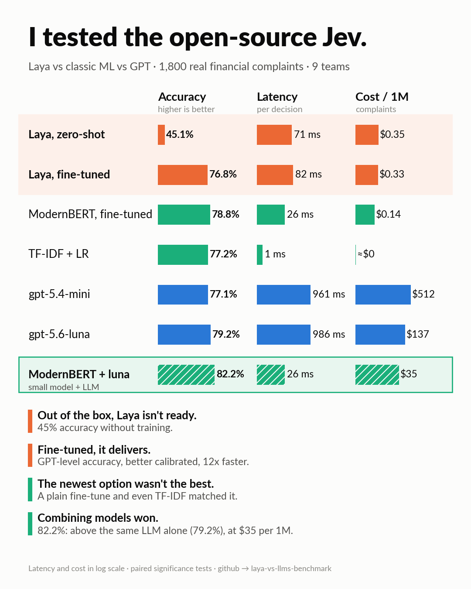
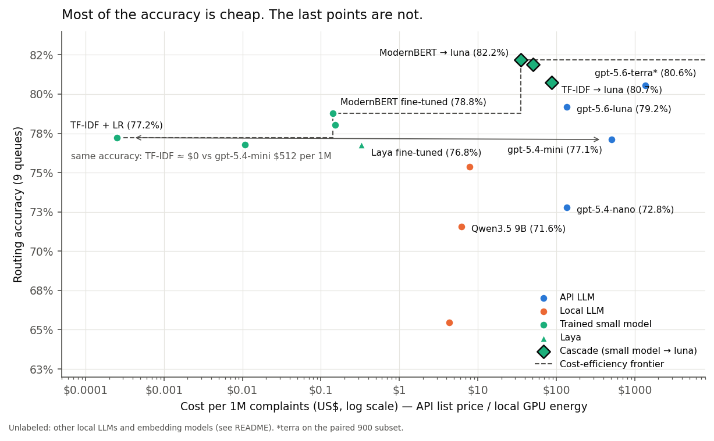
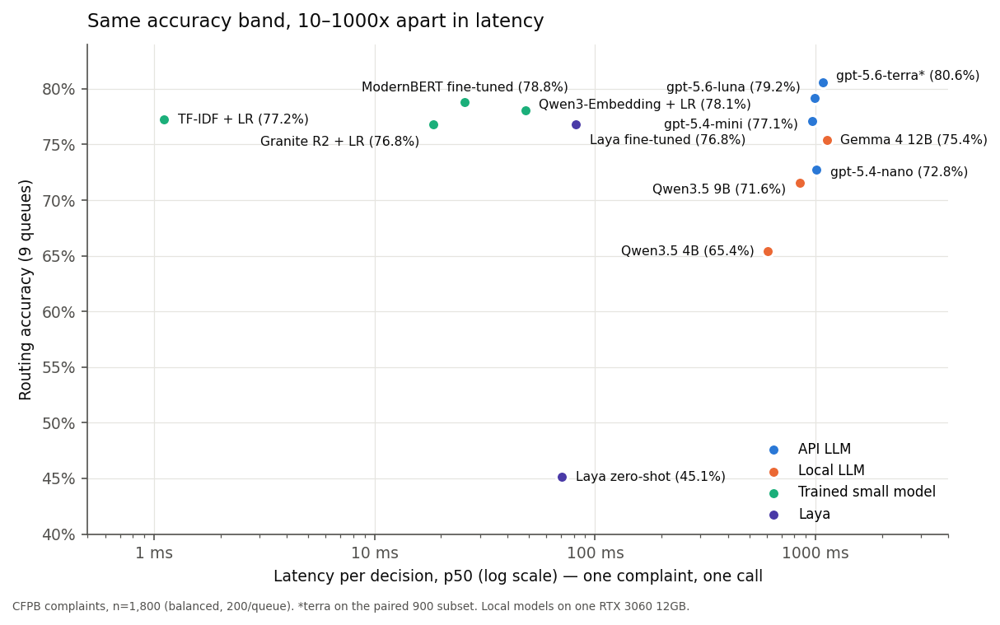
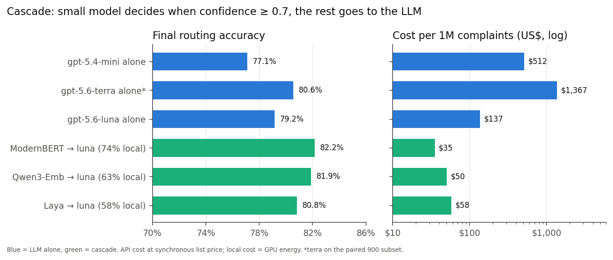

# Laya vs LLMs: picking the right model for financial complaint triage

Every few weeks a new model is announced as the one that replaces everything. Lately it's
[Jev](https://en.wikipedia.org/wiki/Jev_(AI_model)) (TypeSafe AI): a "System 1" model that makes typed
decisions — pick an option, score, yes/no — with calibrated probabilities in a single forward pass, instead of
generating text like an LLM.

Jev is in early access, so this repo tests its open-source counterpart, [Laya](https://github.com/NandhaKishorM/laya),
on a real decision task — routing 1,800 US consumer-finance complaints to 9 teams and flagging fraud reports —
against 12 other systems: classic ML, fine-tuned small models, local LLMs and paid GPT models. Every system is
measured on the same complaints for **accuracy, latency, cost and calibration**, with paired significance tests.

*Model versions and API prices as of September–October 2026.*



## TL;DR

- **Out of the box, Laya isn't ready.** Zero-shot it routes 45% of complaints correctly and its
  probabilities are far off (fraud ECE 0.45).
- **Fine-tuned, it delivers.** With 3,600 labeled complaints Laya reaches 76.8% — level with gpt-5.4-mini
  (77.1%) — with better-calibrated probabilities (ECE 0.05 vs 0.11) and 12x lower latency (82 ms vs 961 ms).
- **But the newest option wasn't the best one.** ModernBERT-large, Laya's own backbone, fine-tuned with
  ordinary cross-entropy on the same data reaches 78.8% (+2.0 pp, not significant after correction), a
  slightly higher fraud AUC and 3x lower latency. A 20-line TF-IDF + logistic regression ties gpt-5.4-mini
  (77.2% vs 77.1%, p = 1) in 1 ms, for practically nothing.
- **LLMs are slow and overconfident here.** ~1 s per decision whether they run through an API or on a local
  GPU, and every LLM overstates its confidence (ECE 0.09–0.21; when gpt-5.4-mini says 97% fraud, it is right
  62% of the time).
- **Combining models gave the best result.** A fine-tuned ModernBERT answers when it is confident (74% of
  complaints) and passes only the doubtful ones to `gpt-5.6-luna`: **82.2% accuracy at US$ 35 per 1M
  complaints** — significantly above luna alone (79.2%, p < 0.001) and statistically tied with the most
  expensive model, `gpt-5.6-terra` (80.6%, US$ 1,367 per 1M), at 1/39 of its cost.

**Reading the numbers.** *Accuracy*: share of complaints sent to the right team. *Calibration error (ECE)*:
how far a model's stated confidence is from how often it is actually right (0 = says 80% and is right 80% of
the time). *p50 latency*: median time for one decision. *pp*: percentage points. *Cascade*: a small model
answers when it is confident and passes the rest to an LLM.

## Choosing the right model

Popularity is not a design criterion. The same benchmark points to different answers depending on what the
application can afford:

| Your situation | What worked here | Why |
|---|---|---|
| No labeled data yet | An LLM (e.g. `gpt-5.6-luna`) | Works zero-shot; Laya zero-shot did not (45%) |
| Labeled data, high volume, tight latency | TF-IDF first, then a fine-tuned encoder | Same accuracy as GPT in 1–80 ms, near-zero cost |
| Every accuracy point matters | Small model + LLM for the doubtful cases | Highest accuracy here, at a fraction of the top model's cost |
| You set thresholds or send cases to humans | A trained small model | Calibrated probabilities; LLM confidence is inflated |
| Data cannot leave your infrastructure | Local small models | Local LLMs still took ~1 s per decision on a GPU |
| Labels change often, or the decision needs reasoning over long context | An LLM | Retraining is not an option; the latency and token cost pay off |

A few rules of thumb from the numbers:

- **Start with the boring baseline.** If labeled data exists, TF-IDF + logistic regression is the bar every
  heavier model has to clear — here it matched gpt-5.4-mini and was better calibrated.
- **Most of the accuracy is cheap; the last points are not.** Going from TF-IDF to the best single model
  buys about 3 points (77.8% → 80.6% on the paired 900 complaints, not significant after correction) for
  ~US$ 1,400 per 1M decisions and ~1 s per call.
- **Spend the LLM only where the small model is unsure.** Swapping the fallback from luna to terra changed
  nothing (82.1% vs 82.0%) at 10x the cost: once the easy cases are filtered out, the expensive model has
  little left to add.



## Hardware and cost

Everything local ran on one desktop with an **NVIDIA RTX 3060 (12 GB)**: Laya fine-tuning took ~36 min,
ModernBERT ~14 min, and the three local LLMs 18–33 min each for 1,800 complaints. API calls for the whole
experiment cost **about US$ 2.20**, using the Batch API (-50%) for accuracy and a few hundred synchronous
calls for latency.

## Task

Each complaint gets two decisions — the shape of a real triage step at a bank or fintech:

1. **Queue** (9 classes): credit reporting, debt collection, credit card, checking/savings, money transfer,
   mortgage, vehicle loan, student loan, personal loan.
2. **Fraud report** (probability): does the consumer report fraud, a scam or identity theft? This flags the
   *text* for prioritization — it is not a transaction fraud detector.

## Data

- [CFPB Consumer Complaint Database](https://www.consumerfinance.gov/data-research/consumer-complaints/)
  (public), via the Hugging Face mirror `sovai/cfpb_complaints`: the official bulk download no longer
  includes the narrative column. Narratives from Jan/2023 to May/2024.
- **58.7% of 2023+ narratives are near-duplicate form letters** (71.5% in credit reporting). They were
  removed; otherwise models score by memorizing templates.
- Labels come from the product and issue the consumer selected. Ambiguous fraud labels ("information
  belongs to someone else", monitoring-service issues) were dropped.
- **Test:** 1,800 complaints, 200 per queue, fraud enriched to 21.2%. **Train:** 3,600, disjoint.
  **Paired subset `s900`:** 100 per queue, used for the expensive model and paired comparisons.

Raw data is not redistributed; `00_download_data.py` rebuilds it (the splits are deterministic). The CFPB
publishes narratives only with the consumer's consent and after removing personal information (names, account
numbers and dates appear as `XXXX`); this repo stores predictions and metrics, never complaint text.

## Results (n = 1,800)

| System | Type | Queue acc. | Fraud AUC | Fraud ECE ↓ | p50 latency | US$ / 1M |
|---|---|---|---|---|---|---|
| gpt-5.6-terra ¹ | API LLM | **80.6%** | 0.872 | 0.143 | 1,075 ms | 1,367 |
| gpt-5.6-luna | API LLM | 79.2% | 0.850 | 0.164 | 986 ms | 137 |
| ModernBERT-large, fine-tuned | small model | 78.8% | **0.906** | 0.046 | 26 ms | 0.14 ² |
| Qwen3-Embedding-0.6B + LR | small model | 78.1% | 0.888 | 0.038 | 48 ms | 0.15 ² |
| TF-IDF + LR | small model | 77.2% | 0.865 | 0.052 | **1 ms** | ~0 ² |
| gpt-5.4-mini | API LLM | 77.1% | 0.868 | 0.111 | 961 ms | 512 |
| Granite-embedding-small-r2 + LR | small model | 76.8% | 0.866 | **0.034** | 18 ms | 0.01 ² |
| Laya, fine-tuned | **Laya** | 76.8% | 0.889 | 0.050 | 82 ms | 0.33 ² |
| Gemma 4 12B (Ollama) | local LLM | 75.4% | 0.788 | 0.163 | 1,123 ms | 7.8 ² |
| gpt-5.4-nano | API LLM | 72.8% | 0.853 | 0.206 | 1,011 ms | 137 |
| Qwen3.5 9B (Ollama) | local LLM | 71.6% | 0.810 | 0.086 | 848 ms | 6.2 ² |
| Qwen3.5 4B (Ollama) | local LLM | 65.4% | 0.641 | 0.207 | 608 ms | 4.3 ² |
| Laya, zero-shot | **Laya** | 45.1% | 0.676 | 0.450 | 71 ms | 0.35 ² |

¹ Evaluated on the paired `s900` subset (cost). On `s900`, the ordering of the other systems is unchanged
(`results/summary.md`). ² Local cost = GPU energy at batched throughput (170 W, US$ 0.15/kWh).
API cost = synchronous list price; the Batch API halves it. Latency = one complaint per call.



### Cascade (threshold fixed at 0.7 before looking at results)

| Local model → fallback | Decided locally | Final accuracy | US$ / 1M |
|---|---|---|---|
| ModernBERT → gpt-5.6-luna | 74% | **82.2%** | **35** |
| Qwen3-Embedding + LR → gpt-5.6-luna | 63% | 81.9% | 50 |
| Laya fine-tuned → gpt-5.6-luna | 58% | 80.8% | 58 |
| ModernBERT → gpt-5.4-mini | 74% | 81.0% | 132 |

`results/cascade_best.csv` lists the best threshold per cascade (up to 82.5%), but that threshold is chosen on
the test set and is therefore optimistic.



## Statistical significance

All systems answered the same complaints, so every test is paired (`16_significance.py`,
`results/significance.md`). Accuracy: exact McNemar test, Holm-corrected across 10 comparisons fixed before
looking at the results, plus a paired bootstrap 95% CI. Fraud: paired bootstrap CIs of the AUC and ECE gaps.

| Comparison | Δ accuracy | 95% CI | p (Holm) |
|---|---|---|---|
| Cascade ModernBERT → luna vs luna alone | +3.0 pp | [+1.6, +4.4] | < 0.001 |
| Cascade ModernBERT → luna vs ModernBERT alone | +3.4 pp | [+2.0, +4.8] | < 0.001 |
| gpt-5.6-luna vs gpt-5.4-mini | +2.1 pp | [+0.8, +3.3] | 0.017 |
| gpt-5.6-luna vs ModernBERT | +0.4 pp | [−1.7, +2.4] | 1 |
| ModernBERT vs Laya fine-tuned | +2.0 pp | [+0.4, +3.7] | 0.15 |
| ModernBERT vs TF-IDF | +1.6 pp | [−0.3, +3.3] | 0.52 |
| TF-IDF vs gpt-5.4-mini | +0.1 pp | [−2.0, +2.3] | 1 |
| gpt-5.6-terra vs gpt-5.6-luna (s900) | +1.0 pp | [−0.6, +2.6] | 1 |
| gpt-5.6-terra vs TF-IDF (s900) | +2.8 pp | [+0.1, +5.6] | 0.31 |
| Cascade → terra vs cascade → luna (s900) | −0.1 pp | [−1.1, +0.9] | 1 |

Post-hoc (not in the fixed list, uncorrected): cascade ModernBERT → luna vs gpt-5.6-terra on s900,
+1.6 pp, CI [−0.3, +3.3], p = 0.13.

Fraud (bootstrap 95% CI of the difference, not multiplicity-corrected): ModernBERT beats gpt-5.4-mini on AUC
(+0.038 [+0.018, +0.058]) and on ECE (−0.065 [−0.083, −0.045]); TF-IDF ties gpt-5.4-mini on AUC
(−0.002 [−0.025, +0.019]) but is better calibrated (−0.058 [−0.078, −0.040]); ModernBERT and Laya tie on
ECE (−0.004 [−0.015, +0.009]).

## Method

- **Same instructions for every API LLM:** identical system prompt and JSON schema (structured outputs),
  reasoning effort `none`. Accuracy runs via the Batch API; latency from 198 synchronous calls.
- **Local LLMs** (Ollama 0.35): the model answers `<letter> <Y|N>` and the probabilities are read from the
  token logprobs, so their calibration is measured on real probabilities, not on a verbalized number.
- **Laya:** zero-shot with the English checkpoint, then fine-tuned with its own RLCD objective, adapted
  from the [official notebook](https://github.com/NandhaKishorM/laya/blob/main/notebooks/laya_finetune_typed_decisions_2xT4_kaggle.ipynb)
  to one GPU (3 epochs), with temperature calibration on 200 held-out training complaints.
- **ModernBERT-large control:** Laya's own backbone, fine-tuned with ordinary cross-entropy on the same
  3,600 complaints and calibrated on the same held-out slice. It isolates what RLCD adds.
- **Embeddings:** frozen encoder + `LogisticRegressionCV`. **TF-IDF:** 1–2-grams + logistic regression.
- **Metrics:** accuracy and macro-F1 for the queue; ROC AUC, precision/recall and expected calibration error
  (10 bins) for fraud; p50/p95 latency of a single decision; cost per 1M complaints.

## Limitations

- Labels are what consumers picked in a form, so some "errors" are legitimate (a debt that shows up on a
  credit report fits two queues). The ceiling is below 100%.
- The test set is balanced by queue and enriched for fraud; it does not reflect production frequencies.
- English only; one random split and one seed per model; prompts were not tuned per model.
- Laya reads at most ~338 tokens of each complaint (its 512-token window is shared with the question and
  options). It reads the full text in 73.6% of complaints.
- API latency depends on network location (measured from southern Brazil).
- TypeSafe's Jev itself was not tested (early access only).

## What's next

- **Recalibrate LLM confidence** (Platt scaling, isotonic regression) and measure how many labeled examples
  it takes to fix the overconfidence.
- **Few-shot prompts** for the LLMs: does giving them a handful of labeled examples close the gap with the
  fine-tuned models?
- **Portuguese complaints**, to check whether the conclusions hold outside English.
- **Jev itself**, once access opens.

## Reproduce

```bash
uv venv --python 3.10 && source .venv/bin/activate
uv pip install -r requirements.txt
export USE_TF=0                      # only if TensorFlow is installed system-wide

python 00_download_data.py           # data/cfpb_2023plus.parquet
python 02_prepare.py                 # dedup, labels, train/test splits
python 12_make_samples.py            # paired s900 + latency subset
python download_models.py            # HF weights (resumable)
./pull_ollama_models.sh              # local LLMs (Ollama >= 0.12.11)

./run.sh 1 2 3                       # all local systems, one GPU job at a time (~3.5 h on an RTX 3060)
python 13_llm_api.py estimate        # API cost table (free)
python 13_llm_api.py submit openai gpt-5.6-luna full --spend   # paid; never overwrites results
python 06_analyze.py                 # results/summary.md + cascades
python 15_figures.py                 # figures
python 16_significance.py            # paired significance tests
python 17_hero_figure.py             # summary figure
```

`SMOKE=1` runs any local script on 5 complaints. Paid scripts refuse to run without `--spend` and stop at a
budget cap (`BUDGET_USD`, default 2). The full experiment cost about **US$ 2.20** in API calls.

## Troubleshooting

- **`no CUDA` after the machine wakes from suspend** (PyTorch reports "CUDA unknown error", kernel log shows
  an Xid error): reload the NVIDIA UVM module with `sudo rmmod nvidia_uvm && sudo modprobe nvidia_uvm`, or
  reboot.
- **Out of memory on a 12 GB GPU:** run GPU jobs one at a time (`run.sh` already does). Batched Laya
  inference takes ~5 GB and fine-tuning ~9 GB.
- **`transformers` fails importing Keras/TensorFlow:** `export USE_TF=0`.

## Layout

| File | Step |
|---|---|
| `00_download_data.py`, `02_prepare.py`, `12_make_samples.py` | data, dedup, labels, splits |
| `build_eda_notebook.py` → `07_eda.ipynb` | exploratory analysis |
| `llm_prompt.py`, `04_llm_baseline.py`, `13_llm_api.py`, `14_api_plan.sh` | API LLMs (shared prompt, budget guard) |
| `11_tfidf.py`, `09_embeddings_logreg.py`, `08_encoder_finetune.py` | small-model baselines and control |
| `03_laya_eval.py`, `05_finetune.py` | Laya zero-shot, fine-tuning, evaluation |
| `10_local_llm.py`, `pull_ollama_models.sh` | local LLMs via Ollama with logprobs |
| `06_analyze.py`, `15_figures.py`, `run.sh` | metrics, paired comparison, cascades, figures |
| `16_significance.py` | paired significance tests (McNemar, bootstrap) |
| `17_hero_figure.py` | the summary figure at the top of this README |
| `common.py`, `sysio.py`, `download_models.py` | shared definitions, result format, model download |
| `results/` | per-system predictions (no complaint text), summary and cascade tables |

## Notes

Personal project built on public data; not affiliated with any employer. The numbers in this README are the
ones published with the original post; the `v1.0` tag marks that snapshot. Model weights follow their own
licenses (Laya: Apache-2.0; ModernBERT, Qwen and Granite: Apache-2.0; Gemma 4: Apache-2.0).

Code: [MIT](LICENSE).

## Author

Eduardo Stuani — data engineer working on LLM evaluation and data pipelines.
[LinkedIn](https://www.linkedin.com/in/eduardostuani)
